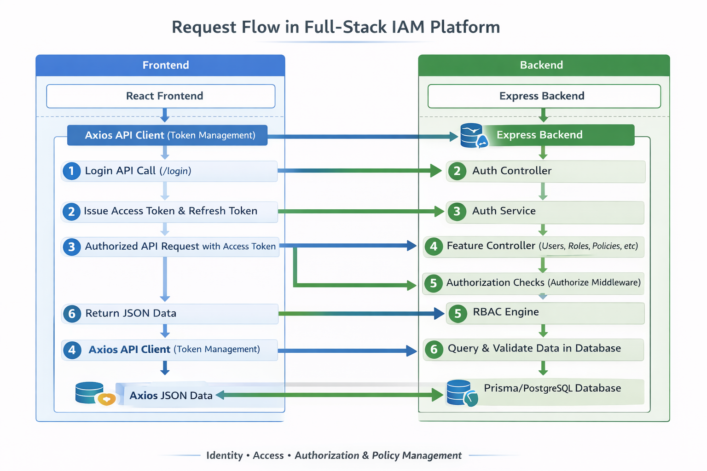

<div align="center">
  <h1>AegisMesh</h1>
  <p>Enterprise-ready IAM platform with MFA, OAuth, session control, audit logs, and dynamic RBAC in one unified admin console.</p>
</div>


## Problem Statement

Managing authentication, authorization, and security governance across modern applications is often fragmented and difficult to scale. Teams need centralized identity controls, policy-based permissions, and clear auditability for sensitive operations. AegisMesh solves this by combining auth, MFA, RBAC, and audit logging into a single platform.


## Features

### Authentication & Sessions

- **Secure Authentication:** Supports email/password auth, JWT access and refresh tokens, secure cookies, and token refresh flow.
- **OAuth Sign-In:** Google and GitHub OAuth login with organization policy enforcement to allow or block OAuth.
- **Multi-Factor Authentication (MFA):** TOTP setup, verification, disable flow, and backup-code regeneration for stronger account security.
- **Session Control:** View active sessions, revoke specific sessions, revoke all other sessions, and monitor device-level access.

### Authorization & Access Control

- **Dynamic RBAC Engine:** Evaluates permissions in real time across users, roles, groups, and policies, with explicit DENY always overriding ALLOW.
- **Policy Simulation:** Lets admins test policy outcomes before rollout to validate access behavior and reduce permission mistakes.
- **Role Management:** Create, update, delete, template, and assign roles, including attaching and detaching policies per role.
- **Group Management:** Organize users into groups, then attach roles to groups for scalable permission inheritance.
- **Granular User Permissions View:** Inspect effective user permissions, assigned roles, and group memberships for fast access audits.

### User & Organization Management

- **User Lifecycle Management:** Create users, update status, verify email, delete users, and perform bulk operations (status, roles, groups, delete, export).
- **Organization Administration:** SuperAdmin controls for organization settings, policy reset, and organization data export.
- **API Key Management:** Create scoped API keys/tokens with extra reauth for privileged scopes, plus key revocation.

### Security, Monitoring & Operations

- **Reauthentication for Sensitive Actions:** Requires fresh identity verification for high-risk operations like password change, account deletion, and privileged token creation.
- **Audit & Security Monitoring:** Centralized audit logs with stream, stats, security alerts, user-specific history, export, and cleanup actions.
- **Notification Center:** Fetch notifications, mark single/all as read, and delete notification entries.
- **Security Hardening:** Built-in validation, rate limiting, account protection controls, and middleware-driven authorization on protected routes.

## Architecture 


## Flow

<p align="center">
  
</p>

## Tech Stack

**Frontend:** React, Vite, Tailwind CSS  
**Backend:** Node.js, Express  
**Database:** PostgreSQL, Prisma  
**Security & Auth:** JWT, Passport, TOTP MFA, OAuth

## How It Works

1. Users authenticate via email/password or OAuth, with MFA where enabled.
2. Backend issues JWT access/refresh tokens and tracks active sessions.
3. RBAC engine evaluates user permissions from roles, groups, and policies.
4. Protected routes enforce auth + authorization middleware before actions are executed.
5. Sensitive actions are written to audit logs for traceability and compliance.

## Installation / Setup

```bash
git clone https://github.com/<your-username>/aegismesh-iam.git
cd aegismesh-iam

cd backend
npm install

cd ../frontend
npm install
```

```bash
# Run backend (default: port 5000)
cd backend
npm run dev

# Run frontend (default: port 5173)
cd ../frontend
npm run dev
```

## Environment Variables

Configure environment values (primarily in `backend/.env`):

```env
DATABASE_URL=

JWT_SECRET=
JWT_REFRESH_SECRET=

GOOGLE_CLIENT_ID=
GOOGLE_CLIENT_SECRET=

GITHUB_CLIENT_ID=
GITHUB_CLIENT_SECRET=

SMTP_HOST=
SMTP_USER=
SMTP_PASS=
```

## API Endpoints

- `POST /api/auth/login`
- `POST /api/auth/register`
- `POST /api/auth/refresh-token`
- `GET /api/auth/me`
- `GET /api/roles`
- `POST /api/policies`
- `GET /api/users/:id/permissions`

## Folder Structure

```text
.
├── backend/
│   ├── prisma/
│   │   ├── schema.prisma
│   │   └── migrations/
│   ├── src/
│   │   ├── config/
│   │   ├── controllers/
│   │   ├── middleware/
│   │   ├── routes/
│   │   ├── services/
│   │   └── utils/
│   └── package.json
├── frontend/
│   ├── src/
│   │   ├── components/
│   │   ├── context/
│   │   ├── pages/
│   │   ├── services/
│   │   └── utils/
│   └── package.json
├── diagrams/
└── README.md
```

## License

MIT License

## Author / Contact

Nirjar Goswami  
GitHub: https://github.com/Nirjar26

