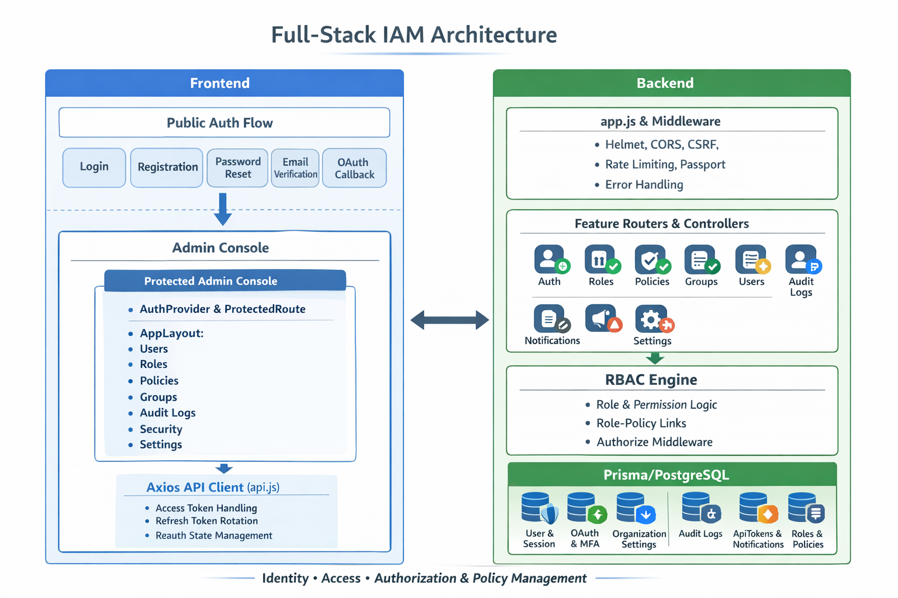

<div align="center">
  <h1>AegisMesh</h1>
  <p>Enterprise-ready IAM platform with MFA, OAuth, session control, audit logs, and dynamic RBAC in one unified admin console.</p>
</div>


## Problem Statement

Managing authentication, authorization, and security governance across modern applications is often fragmented and difficult to scale. Teams need centralized identity controls, policy-based permissions, and clear auditability for sensitive operations. AegisMesh solves this by combining auth, MFA, RBAC, and audit logging into a single platform.


## Features

### Authentication & Sessions

- **Secure Authentication:** Supports email/password auth, JWT access and refresh tokens, secure cookies, and token refresh flow.
- **OAuth Sign-In:** Google and GitHub OAuth login with organization policy enforcement to allow or block OAuth.
- **Multi-Factor Authentication (MFA):** TOTP setup, verification, disable flow, and backup-code regeneration for stronger account security.
- **Session Control:** View active sessions, revoke specific sessions, revoke all other sessions, and monitor device-level access.

### Authorization & Access Control

- **Dynamic RBAC Engine:** Evaluates permissions in real time across users, roles, groups, and policies, with explicit DENY always overriding ALLOW.
- **Policy Simulation:** Lets admins test policy outcomes before rollout to validate access behavior and reduce permission mistakes.
- **Role Management:** Create, update, delete, template, and assign roles, including attaching and detaching policies per role.
- **Group Management:** Organize users into groups, then attach roles to groups for scalable permission inheritance.
- **Granular User Permissions View:** Inspect effective user permissions, assigned roles, and group memberships for fast access audits.

### User & Organization Management

- **User Lifecycle Management:** Create users, update status, verify email, delete users, and perform bulk operations (status, roles, groups, delete, export).
- **Organization Administration:** SuperAdmin controls for organization settings, policy reset, and organization data export.
- **API Key Management:** Create scoped API keys/tokens with extra reauth for privileged scopes, plus key revocation.

### Security, Monitoring & Operations

- **Reauthentication for Sensitive Actions:** Requires fresh identity verification for high-risk operations like password change, account deletion, and privileged token creation.
- **Audit & Security Monitoring:** Centralized audit logs with stream, stats, security alerts, user-specific history, export, and cleanup actions.
- **Notification Center:** Fetch notifications, mark single/all as read, and delete notification entries.
- **Security Hardening:** Built-in validation, rate limiting, account protection controls, and middleware-driven authorization on protected routes.

## Architecture 



## Application Flow

1. User opens the frontend and lands on public routes (login, register, password reset, verify email, or OAuth callback).
2. On login/register/OAuth success, backend returns access and refresh tokens plus user profile data.
3. Frontend stores tokens, sets auth state, and schedules silent token refresh before access-token expiry.
4. Protected routes are enforced in the client; unauthenticated users are redirected to login.
5. For protected API calls, backend receives requests through security middleware (Helmet, CORS, parsing, CSRF checks for mutating routes, and rate limiting).
6. Authentication middleware validates JWT (or scoped API key token), loads the active user/session, and applies organization-level policy checks.
7. Authorization logic evaluates effective permissions from direct role assignments, group-inherited roles, and attached policies; explicit DENY takes precedence over ALLOW.
8. If authorized, controller/service layers execute the action (user management, roles, policies, groups, settings, notifications, or security operations).
9. Sensitive and administrative actions are written to audit logs; audit endpoints provide stream, stats, filtering, export, and cleanup support.
10. Frontend updates views using React Query and route-level modules, keeping dashboard state synchronized with backend responses.

### Sensitive Action Flow

1. User triggers a high-risk operation (for example: password change, account deletion, or privileged API key creation).
2. Backend enforces reauthentication requirements for the operation.
3. After reauth succeeds, the action proceeds through the same authentication and authorization pipeline.
4. Result is returned to frontend and the event is captured in audit logs for traceability.

### Core Request Pipeline

`Client Request -> Security Middleware -> Authentication -> Org Policy Checks -> RBAC Evaluation -> Controller/Service -> Prisma/PostgreSQL -> Audit/Response -> Frontend Refresh`

## Tech Stack

**Frontend:** React, Vite, Tailwind CSS  
**Backend:** Node.js, Express  
**Database:** PostgreSQL, Prisma  
**Security & Auth:** JWT, Passport, TOTP MFA, OAuth

## How It Works

1. Users authenticate via email/password or OAuth, with MFA where enabled.
2. Backend issues JWT access/refresh tokens and tracks active sessions.
3. RBAC engine evaluates user permissions from roles, groups, and policies.
4. Protected routes enforce auth + authorization middleware before actions are executed.
5. Sensitive actions are written to audit logs for traceability and compliance.

## Installation & Setup

### Option 1: Docker (Recommended)

**Requirements:** Docker & Docker Compose

```bash
git clone https://github.com/Nirjar26/Aegismesh-IAM.git
cd AegisMesh-IAM

# Copy and configure environment variables
cp .env.example .env

# Start all services (PostgreSQL, Backend, Frontend)
docker-compose up --build
```

**Access the application:**
- Frontend: http://localhost:3000
- Backend API: http://localhost:5000
- Database: localhost:5432

**Development mode with hot reload:**
```bash
docker-compose -f docker-compose.yml -f docker-compose.dev.yml up
```

For detailed Docker setup instructions, see [Docker_Setup.md](./DOCKER_SETUP.md).

### Option 2: Local Development

**Requirements:** Node.js 18+, PostgreSQL 15+

```bash
git clone https://github.com/Nirjar26/Aegismesh-IAM.git
cd AegisMesh-IAM

# Backend setup
cd backend
npm install
npm run prisma:generate

# Frontend setup
cd ../frontend
npm install
```

**Run services:**
```bash
# Terminal 1: Backend (default: port 5000)
cd backend
npm run dev

# Terminal 2: Frontend (default: port 5173)
cd frontend
npm run dev
```

## Environment Variables

Copy `.env.example` to `.env` and configure:

```env
# Database (Docker uses 'db' as hostname, local uses 'localhost')
DATABASE_URL=""

# JWT
JWT_SECRET="your-secret-key"
JWT_REFRESH_SECRET="your-refresh-secret"

# OAuth (Google & GitHub)
GOOGLE_CLIENT_ID=
GOOGLE_CLIENT_SECRET=

GITHUB_CLIENT_ID=
GITHUB_CLIENT_SECRET=

# Email
SMTP_HOST=smtp.ethereal.email
SMTP_USER=
SMTP_PASS=

# Frontend API URL
VITE_API_URL="http://localhost:5000"
```

See [`.env.example`](./.env.example) for all available options.

## API Endpoints

- `POST /api/auth/login`
- `POST /api/auth/register`
- `POST /api/auth/refresh-token`
- `GET /api/auth/me`
- `GET /api/roles`
- `POST /api/policies`
- `GET /api/users/:id/permissions`

## Folder Structure

```text
.
├── backend/
│   ├── prisma/
│   │   ├── schema.prisma
│   │   └── migrations/
│   ├── src/
│   │   ├── config/
│   │   ├── controllers/
│   │   ├── middleware/
│   │   ├── routes/
│   │   ├── services/
│   │   └── utils/
│   └── package.json
├── frontend/
│   ├── src/
│   │   ├── components/
│   │   ├── context/
│   │   ├── pages/
│   │   ├── services/
│   │   └── utils/
│   └── package.json
├── diagrams/
└── README.md
```

## License

MIT License

## Author / Contact

Nirjar Goswami  
GitHub: https://github.com/Nirjar26

